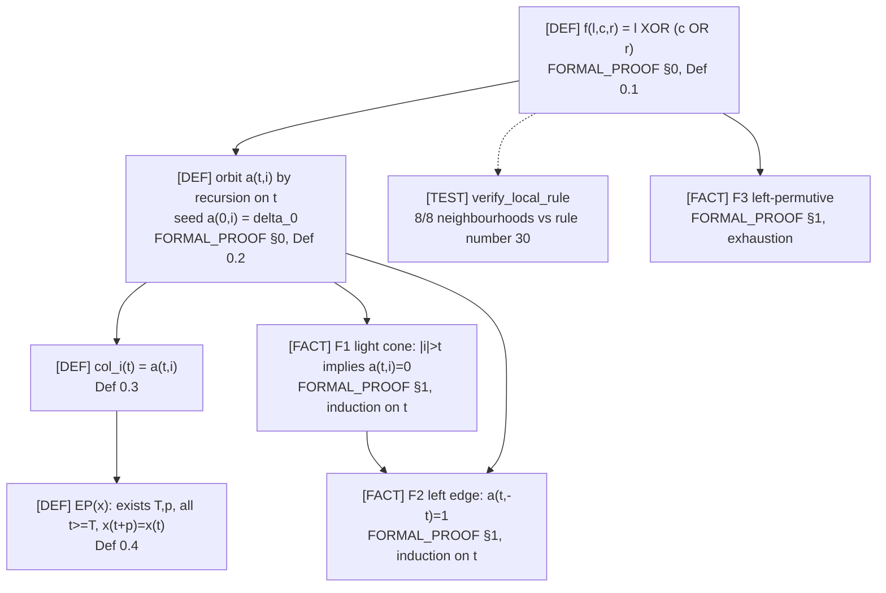
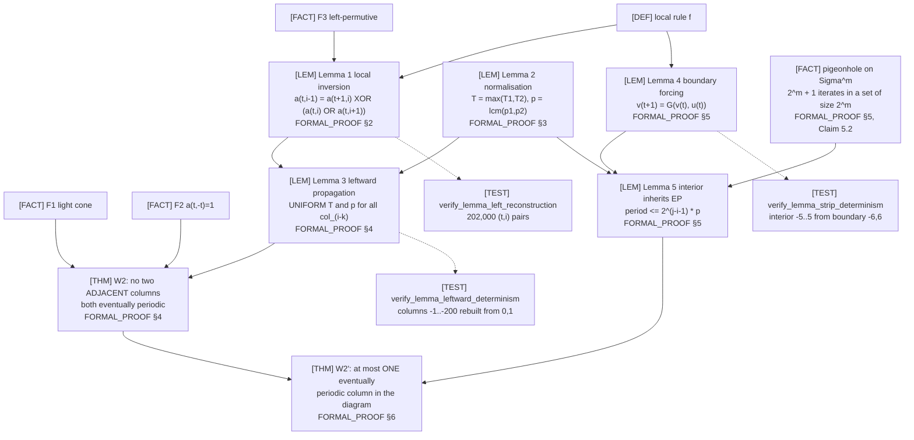
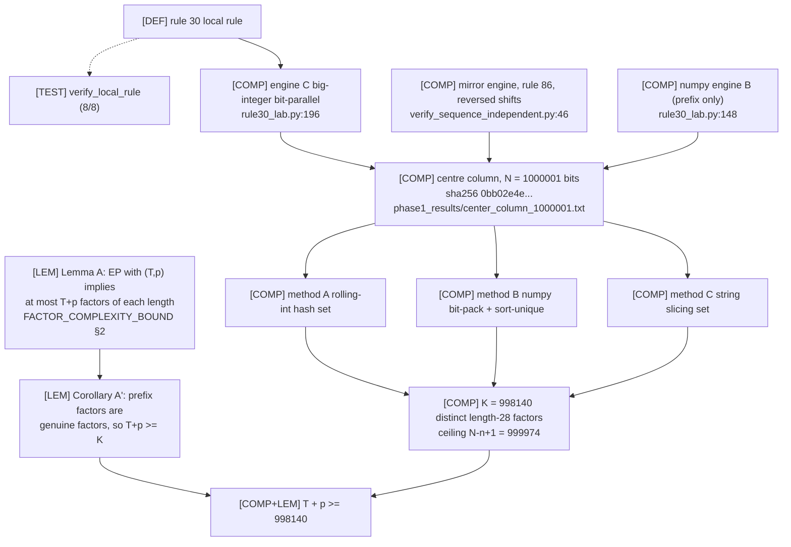
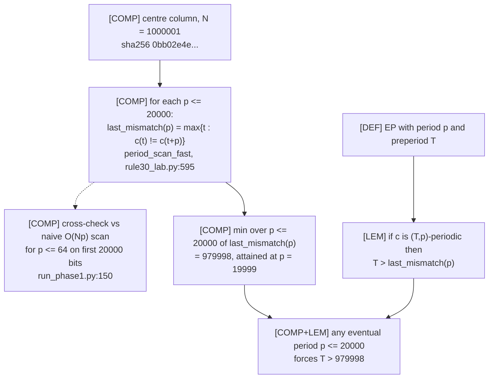
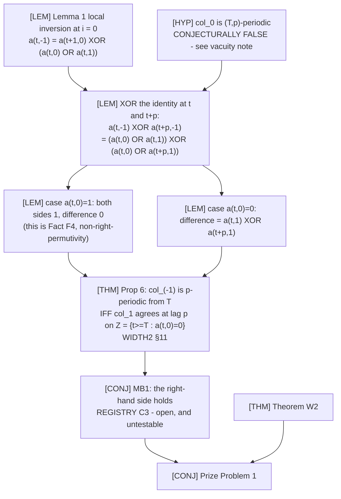
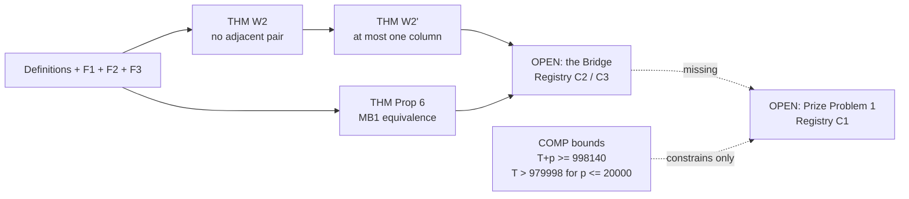

# Proof Dependency Graph

Complete logical dependencies behind the four load-bearing results. Every node
is either a **definition**, a **proved statement** (with the file and section
where its proof is written out), or a **finite computation** (with the script
that performs it and the artifact holding its output).

Legend:

* `[DEF]` definition — nothing to verify beyond internal consistency
* `[FACT]` / `[LEM]` / `[THM]` proved here; proof location given
* `[COMP]` finite computation; script and artifact given
* `[TEST]` mechanical check of a proved statement's computational content —
  **supports** confidence in the implementation, is **not** part of the proof
* `[EXT]` external input

Arrows point **from prerequisite to consequence**.

---

## 0. Shared foundation



`F1` and `F2` are the **only** properties of the initial condition used
anywhere in §1 below. Both hold for any finitely supported seed — this is why
Theorem W2′ cannot by itself settle Prize Problem 1 (`CLAIM_LEDGER.md` E4).

---

## 1. Theorem W2′ — "at most one eventually periodic column"



### Dependency table

| Node | Depends on | Proof | Mechanical check |
|---|---|---|---|
| Lemma 1 | Def 0.1, F3 | `FORMAL_PROOF §2` (one line: XOR both sides) | `verify_lemma_left_reconstruction` — PASS |
| Lemma 2 | — | `FORMAL_PROOF §3` (induction on `s ≤ k` where `p = k·p₁`) | none (pure arithmetic) |
| Lemma 3 | Lemma 1, Lemma 2 | `FORMAL_PROOF §4` (induction on `k`, paired hypothesis `P(k)`) | `verify_lemma_leftward_determinism` — PASS |
| **Theorem W2** | Lemma 3, F1, F2 | `FORMAL_PROOF §4` (choose `j = min(i, −(T+p))`; three steps) | **none possible** |
| Lemma 4 | Def 0.1 (radius 1) | `FORMAL_PROOF §5` | `verify_lemma_strip_determinism` — PASS |
| Lemma 5 | Lemma 2, Lemma 4, pigeonhole | `FORMAL_PROOF §5` (Claims 5.1–5.3) | none |
| **Theorem W2′** | Theorem W2, Lemma 5 | `FORMAL_PROOF §6` (two cases: `j = i+1`, `j ≥ i+2`) | **none possible** |

### Critical steps a reviewer should attack first

1. **Uniformity of `T` in Lemma 3.** If the preperiod grew with `k`, Step 2 of
   Theorem W2 would fail. Proof at `FORMAL_PROOF_AT_MOST_ONE_COLUMN.md:184`;
   the point is that only indices `t` and `t+1` are consulted, both `≥ T`.
2. **The choice `j = min(i, −(T+p))`** and the inequality `T + p ≤ n = −j`,
   which is what makes the interval `[T, T+p)` lie entirely below the light
   cone's arrival time at site `j`.
3. **Claim 5.1**, `v(T+kp) = Hᵏ(v(T))`: it needs `u(T+kp+s) = u(T+s)` for all
   `0 ≤ s < p`, which is `(∗)` applied `k` times.

### What is *not* used

No compactness, no König's lemma, no axiom of choice, no reversibility of the
global map (only the local rule is inverted, in its first argument only), and
no bi-infinite time. Argued in full at
`FORMAL_PROOF_AT_MOST_ONE_COLUMN.md §7`.

---

## 2. The bound `T + p ≥ 998140`



### Dependency table

| Node | Value / location | Verification |
|---|---|---|
| Sequence | `center_column_1000001.txt`, sha256 `0bb02e4e…` | regenerated bit-for-bit by the **mirror engine** (225 s) and prefix-matched by **numpy**: `phase1_results/verify_seq_1M.log` |
| Word length | `n = 28` | largest count among `n ∈ {20,24,26,28}` |
| Count | `K = 998140` | **three algorithms agree** — hashing (A, C) and sorting (B): `phase1_results/verify_factor_1M.log` |
| Lemma A | proof `FACTOR_COMPLEXITY_BOUND.md §2` | proof only; no computation |
| Result | `T + p ≥ 998140` | `verify_factor_bound.py` |

### Assumptions and limits

* Depends on the sequence being correct — hence the mirror-engine
  regeneration, which is the only check that catches a shift-direction error.
* Ceiling `N − n + 1 = 999974`: the count is at 99.82% of the maximum
  possible, so this `N` is nearly exhausted. Bigger bounds need bigger `N`,
  linearly.
* **One-sided.** Gives no information about whether such `(T,p)` exists.

---

## 3. The bound `T > 979998` for periods `p ≤ 20000`



### The elementary lemma

If `c(t+p) = c(t)` for every `t ≥ T`, then no `t ≥ T` can have
`c(t) ≠ c(t+p)`. So every mismatch index is `< T`, and in particular
`T > last_mismatch(p)`. Applied to the `p` minimising `last_mismatch(p)`, this
yields a bound valid **for every** `p ≤ 20000` simultaneously.

### Dependency table

| Node | Value | Location |
|---|---|---|
| Scan implementation | big-integer `S ^ (S >> p)` | `rule30_lab.py:595` (`period_scan_fast`) |
| Cross-check | naive `O(Np)` scan, `p ≤ 64`, first 20000 bits — agrees exactly | `run_phase1.py:150`; `phase1_results.json: period_scan_crosscheck_naive_vs_fast = true` |
| Result at `N = 10⁶` | `min last_mismatch = 979998` at `p = 19999`; no `p ≤ 20000` survives the window | `anomaly_followup.json: period_scan` |
| Result at `N = 2·10⁵` | `min last_mismatch = 189998` at `p = 10000` | `phase1_results.json: period_scan` |

### Limits

Covers only `p ≤ 20000`. Says nothing about larger periods — for those, D1
(factor bound) is the only constraint, and it constrains only the **sum**
`T + p`.

---

## 4. The MB1 equivalence (Proposition 6)



### Derivation, step by step

Assume `col_0` is `(T,p)`-periodic. For `t ≥ T`, Lemma 1 at `i = 0` gives both

```
a(t,-1)   = a(t+1,0)   XOR ( a(t,0)   OR a(t,1)   )
a(t+p,-1) = a(t+1+p,0) XOR ( a(t+p,0) OR a(t+p,1) )
```

XOR them. Since `t+1 ≥ T`, periodicity kills `a(t+1,0) XOR a(t+1+p,0) = 0`,
and `a(t+p,0) = a(t,0)`. Hence

```
a(t,-1) XOR a(t+p,-1) = ( a(t,0) OR a(t,1) ) XOR ( a(t,0) OR a(t+p,1) ).
```

* If `a(t,0) = 1`: both parentheses are `1`, so the difference is `0`.
  **This case is exactly Fact F4** (rule 30 is not right-permutive): when the
  centre cell is black, the right neighbour is invisible.
* If `a(t,0) = 0`: the difference is `a(t,1) XOR a(t+p,1)`.

So `col_{−1}` is `p`-periodic from `T` **iff** `col_1` agrees at lag `p` at
every `t ∈ Z = { t ≥ T : a(t,0) = 0 }`. ∎

### Consequence chain

```
MB1  ==>  col_(-1) eventually periodic          [Prop 6]
     ==>  col_(-1) and col_0 adjacent, both EP
     ==>  contradiction                          [Theorem W2]
     ==>  col_0 is not eventually periodic       [Prize Problem 1]
```

### Vacuity warning (structural, not incidental)

The hypothesis `HYP` is conjecturally false. If Prize Problem 1 has the
expected answer, **MB1 is vacuously true and no computation can bear on it**.
What was tested instead is the finitary statement MB1-loc(`a`), a *different*
proposition, refuted for `a = 0,4,…,28` (`CLAIM_LEDGER.md` D5). Refuting
MB1-loc does **not** refute MB1.

### Dependency table

| Node | Type | Location | Verification |
|---|---|---|---|
| Lemma 1 at `i = 0` | LEM | `FORMAL_PROOF §2` | `verify_lemma_left_reconstruction` — PASS |
| Fact F4 (case `a(t,0)=1`) | FACT | `WIDTH2 §3` | exhaustive over 8 neighbourhoods |
| Proposition 6 | THM | `WIDTH2 §11`, restated above | proof only |
| MB1 | CONJ | `CONJECTURE_REGISTRY.md` C3 | **untestable by construction** |
| MB1-loc(`a`) | REF for `a ≤ 28` | `find_mb1loc_witnesses.py` | 8 witnesses, each re-simulated twice |

---

## 5. Global summary



The dashed edge into Prize Problem 1 is the entire remaining problem. Nothing
in this package crosses it, and the computational bounds constrain a
hypothetical `(T, p)` without excluding one.
