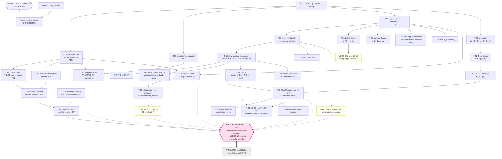

# Theorem Dependency Graph

Three views of the same structure: a Mermaid diagram, a plain-text tree, and a
table. The unresolved **Bridge** is marked in all three.

---

## 1. Mermaid



Solid arrows are **proof dependencies**. Dotted arrows into the Bridge mean
"this route was attempted and reduces back to the Bridge without crossing it".

---

## 2. Plain-text dependency tree

```
local rule  f(l,c,r) = l XOR (c OR r)
├── T-01  left-permutive; left reconstruction; not right-permutive     [ANY]
│   ├── T-2.1  light cone                                              [FIN]
│   ├── T-2.2  frozen left edge                                        [FIN]
│   ├── T-2.3  normalisation (max T, lcm p)                            [—]
│   ├── T-2.4  leftward propagation, uniform in T                      [FIN]
│   │   └── T-02  no two adjacent eventually periodic columns          [FIN]
│   │       ├── T-3.1  boundary forcing
│   │       ├── T-3.2  interior inherits EP  (period <= p·2^{gap})
│   │       └── T-03  AT MOST ONE eventually periodic column           [FIN]
│   └── T-20  XOR spine  |Sk(t)| >= floor(t/2)+1                       [ANY spine]
│       └── T-21.10  diagonal reset schedule = centre column, shifted
│           └── VQ-01  (F3) VACUOUS
├── T-05  exact temporal-defect equation                               [ANY]
│   ├── T-5.1  masking;  T-5.2  support edges d_t(±(t+p)) = 1
│   └── T-06  W1, W2, W3, W6, each on a stated finite range      [conditional]
├── T-07  edge-aligned one-sided recurrence                            [ANY]
│   ├── T-7.1/7.3  boundary and support bounds
│   ├── T-08  every fixed prefix is eventually periodic
│   │   ├── T-10  skew-product trichotomy
│   │   │   ├── T-11  P(K) in {P(K-1), 2P(K-1)}
│   │   │   ├── T-14  non-COLLAPSING iff predecessor eventually zero
│   │   │   ├── T-16  R1 erasure / R2 constant Phi / R3 T(K) <= tau+1
│   │   │   └── T-17  unique cycle word; 2P-bit transducer; (CH3 vacuous)
│   │   ├── T-22  w_t(7) = 0 for all t
│   │   └── VQ-02  (F5) = PROBLEM 1 restated
│   ├── T-15  zero-cycle identity  w_t(m-2) = w_t(m-1)
│   ├── T-21.6  strip identity  q_t(r) = x_t(r);  x_t(0) = w_t(t)
│   │   └── VQ-05  (Phase 2C D1) VACUOUS on the real orbit
│   ├── T-21.7  no strip is autonomous
│   ├── T-21.8  strip automaton: recurrent core = everything, ALL radii
│   ├── T-21.9  strip lookahead exactly R
│   └── T-23  backward cone of the diagonal
├── T-09  projection  pi_K ∘ F_{K+1} = F_K ∘ pi_K                      [—]
│   └── T-12  T non-decreasing;  P(K-1) | P(K)
│       └── T-21.1  T(K) = max_{k<=K} r_{P(K)}(k)
│           └── T-18  EXACT recurrence for T(K) via D(K)      [+ T-16, T-18.1]
│               ├── T-13  strongest upper bounds (T-18 subsumes them)
│               ├── T-19  T(K) = rho(K)+1 on resetting levels
│               ├── T-18.3  telescoping;  T(K)/K = d(K)·m(K) + O(1/K)
│               └── T-21.5  D(K) = w_{T(K-1)}(K) XOR Phi_K
│                           ⇒ not finite-state IN CYCLE DATA  [scope: C-12]
└── factor-counting lemma  +  CC-02 (certificate)
    └── CT-01  T + p >= 998140                              [CONDITIONAL]

                    ============ THE BRIDGE ============
    BR-01   centre column eventually periodic  ⟹  a SECOND column is too
            OPEN.  With T-03 it settles Problem 1 immediately.
    ====================================================
```

---

## 3. Assumptions and consequences table

| theorem | assumes | domain | consequences inside the corpus |
|---|---|---|---|
| T-01 | — | ANY | T-2.4, T-06, T-20 |
| T-02 | finite support | FIN | T-03 |
| T-03 | finite support | FIN | **the target of BR-01** |
| T-05 | — | ANY | T-06 |
| T-06 | a wall on a stated range | ANY | CT-03 |
| T-07 | — | ANY | T-08, T-15, T-21.6–21.9, T-23 |
| T-08 | left boundary | SEED | T-10, T-22, VQ-02 |
| T-09 | — | — | T-12 |
| T-10 | base settled | SEED | T-11, T-14, T-16, T-17 |
| T-11 | T-10 | SEED | T-18(b) |
| T-12 | T-09 | SEED | T-21.1, T-18 |
| T-13 | T-10, T-16 | SEED | subsumed by T-18 |
| T-14 | T-10 | SEED | CT-06, CJ-05 |
| T-15 | T-07 | SEED | (parity transfer only) |
| T-16 | COLLAPSING, base settled | SEED | T-18, T-21.5 |
| T-17 | COLLAPSING | SEED | — (cycle region only) |
| T-18 | T-12, T-16, T-21.1 | SEED | T-19, T-13, T-18.3, T-21.5 |
| T-19 | T-18 | SEED | — |
| T-20 | T-01, T-07 | ANY (spine) | T-21.10 |
| T-21.5 | T-16, T-18 | SEED | refutes one class of finite-state descriptions (C-12) |
| T-21.6 | T-07 | ANY | VQ-05, CT-04 |
| T-21.8 | T-07 | ANY | closes the strip-relaxation route |
| T-21.10 | T-20, T-21.6 | SEED | **VQ-01** |
| T-22 | T-08 | SEED | — |
| T-23 | T-07 | ANY | BO-05, BO-07 |
| CT-01 | factor lemma + CC-02 | SEED | the strongest finite statement in the corpus |

---

## 4. The Bridge, and every route that reduces to it

> **BR-01.** If the centre column of the single-cell rule-30 orbit is
> eventually periodic, then some column `x_t(j)` with `j ≠ 0` is eventually
> periodic.

With **T-03** (at most one column is eventually periodic), BR-01 gives an
immediate contradiction and settles Problem 1.

Five routes were attempted across the corpus. **All five reduce back to
BR-01**, and none crosses it:

| route | phase | formulation | why it reduces to BR-01 |
|---|---|---|---|
| **MB1** | 1 | `col_{−1}` is eventually periodic under (H) | by T-06/Prop. 6, `col_{−1}` periodic + `col_0` periodic contradicts T-02. Needs exactly a second column. **Untestable** (`VQ-03`) |
| **MB1-loc** | 1, 2A | the finitary shadow of MB1 at look-back depth `a` | **refuted for `a ≤ 28`** (`CC-04`); and `CC-05` + `T21.12` show no seed-free local argument at `a ≤ 48`, `p ≤ 64` can prove it. Refutes the *strategy*, not the conjecture |
| **G1 / zero wall** | 2B | an infinite zero wall forces a second periodic column | verbatim BR-01 in defect variables. G2 refuted (`RF-01`), G3 circular (`VQ-04`), G4 partially refuted (`RF-02`) |
| **G5 / F1′** | 2B, 2E | `liminf T(K)/K > 1` — the transient outruns the diagonal | **does not imply anything about the values** the diagonal reads (Route A in Phase 2E §8). Reformulation, not reduction |
| **F4** | 2E | a periodic reset schedule forces a second fixed periodic column | by **T-21.10** the hypothesis *is* (H), so F4 **is** BR-01 in different notation |

Two further items were found to be **not routes at all**: `VQ-01` (F3) is
"(H) ⟹ (H)", and `VQ-02` (F5) is `¬(H)` restated.

### Why the graph has two disconnected halves

The tree above splits at the root into

* a **FIN branch** (T-01 → T-02 → T-03), which is seed-blind and therefore
  cannot decide Problem 1 (Phase 1 §10.3), and
* a **SEED branch** (T-07 → T-08 → the whole prefix tower), which is
  seed-aware but describes the **cycle region** and the **frontier**.

The centre column is the **diagonal**, `x_t(0) = w_t(t)`, which by `BO-03`
lies strictly inside the transient for every `18 ≤ K ≤ 30000`. So the FIN
branch cannot see the seed, and the SEED branch cannot see the diagonal. **The
Bridge is exactly the missing edge between the two halves**, and no theorem in
this corpus supplies it.
